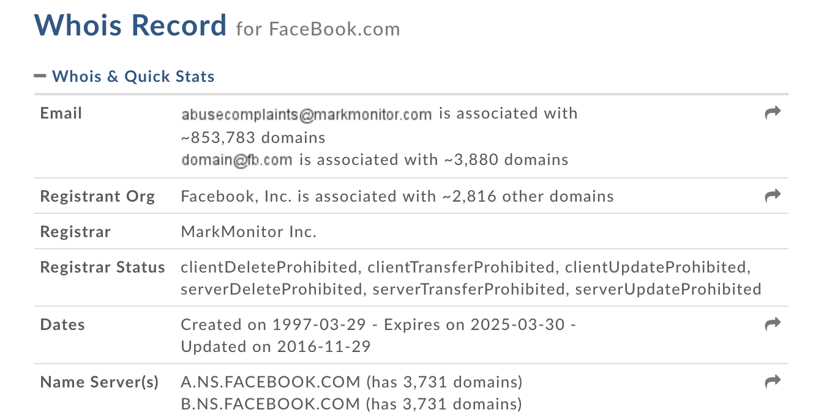

Pour créer un site indépendant, vous devez disposer de deux choses:

- Un nom de domaine.
- Un hébergement.

## Qu'est-ce qu'un nom de domaine

Un nom de domaine est un « masque » sur une adresse IP. Le but d’un nom de domaine est de retenir et communiquer facilement l’adresse d’un ensemble de serveurs (site web, courrier électronique, FTP). Par exemple, facebook.com est plus simple à mémoriser que 208.80.154.224 ou 91.198.174.192.

Un nom de domaine est composé de deux parties: 

* Le nom, p.ex. : facebook
* L’extension: .com/.fr/.ch etc

## Obtenir un nom de domaine

Pour obtenir un nom de domaine, il faut passer par un "registrar", un service d'enregistrement. 

Pour les domaines ".com", ".org", ".net", le prix est d’à peu près 10.- dollars/année. Pour les autres domaines - ".info", ".io", ".fm", ".tv"... - cela varie, il faut chercher.

Quelques registrars réputés: 

* [infomaniak](https://www.infomaniak.com/fr/domaines) 
* [Gandi](http://www.gandi.net/?lang=fr)
* [Namecheap](https://www.namecheap.com/domains/registration.aspx)
* 1and1.com
* [GKG.net](https://www.gkg.net/)

La procédure:

- Vérifiez si le nom de domaine est disponible.
- Procédez à l'achat, pour le nombre d'années que vous souhaitez.
- Ne souscrivez pas à des services inutiles qu'on essayera peut-être de vous vendre.

Sur les procédures complexes pour récupérer un nom de domaine expiré, lire [cet article de Brad Frost](http://bradfrost.com/blog/post/bradfrost-dot-com/).

## Obtenir un hébergement

Contrairement au choix du registrar, le choix de l'hébergement est plus délicat, car la qualité varie d'un prestataire à l'autre, et un mauvais choix signifie:

- Temps de chargement lent.
- Site trop fréquemment inaccessible.
- Problèmes lors des mises à jour de WordPress ou de plugins. 

Ces problèmes ne se détectent qu'à l'utilisation. Il est donc utile de se renseigner auprès d'usagers expérimentés.

Les critères objectifs qui peuvent orienter un choix:

- Le prix.
- L'hébergement permet-il d'utiliser plusieurs domaines, ou un seul?
- L'hébergement comprend-il des services de mailing-liste ou newsletter?
- Les utilisateurs du site seront-ils en Europe, ou sur un autre continent?
- L'espace de stockage.

L'espace de stockage est souvent le critère le moins important. Les hébergeurs offrent souvent des dizaines de gigas d'espace. Avec un site WordPress normal, il vous faudra des milliers d'images pour arriver à remplir 1 ou 2 gigas.

Le choix d'un hébergement aux Etat-Unis ou en Europe devrait dépendre du public cible. Il y a un temps de latence entre les continents, et Google peut favoriser les résultats géographiquement proches.

Quelques hébergeurs réputés, en Suisse:

* Infomaniak
* Hostpoint

Pointer un domaine vers un hébergement
====

Comment pointer un domaine (p.ex. enregistré chez Infomaniak) vers un hébergement (p.ex. OVH):

Il faudra éditer les **Serveurs DNS** du domaine, et entrer les infos pertinentes pour l'hébergeur (en l'occurrence OVH).

- Se connecter sur OVH
- Aller dans "Ajouter une zone DNS"
- Une page tutoriel s'ouvre :  [https://docs.ovh.com/fr/fr/web/domains/creer-une-zone-dns-pour-un-domaine-externe/](https://docs.ovh.com/fr/fr/web/domains/creer-une-zone-dns-pour-un-domaine-externe/)
- Prendre note des informations, notamment les adresses DNS à utiliser.
  
Le domaine enregisté sur Infomaniak est ajouté sur OVH.

- Se connecter sur Infomaniak
- Aller dans "Domaine"
- Clicker sur "Gestion des DNS"
- Clicker sur "Modifier les serveurs DNS"
- Sélectionner "Serveurs de noms personnalisés"
- Écrire les noms DNS que vous trouvez dans OVH puis "Enregistrer"

Voilà !

## Les services WHOIS

Un service WHOIS est un engin de recherche permettant d'obtenir des informations sur un domaine existant.

Cela indiquera en général:

* Quand le domaine a été enregistré.
* Au nom de qui.
* L'adresse IP et son lieu géographique.
* Les serveurs DNS (indiquant quel est l'hébergeur).

Voici par exemple les résultats pour Facebook.com - on peut voir que le domaine à été enregistré le 28 mars 1997, que le registrar se nomme MarkMonitor, et que la compagnie Facebook gère ses propres serveurs DNS.

Quelques services WHOIS:

* [DomainTools](http://whois.domaintools.com/)
